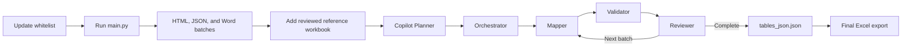

# IBM Curam to HL7 FHIR R4 Mapping

This project assesses how IBM Curam database tables can be mapped to HL7 FHIR R4. It combines Curam table definitions, reviewed business precedents, and explicit quality rules with GitHub Copilot custom agents to produce traceable, reviewable, and machine-validated mapping JSON.

> **Data security:** Curam table structures, internal documentation URLs, and assessment results may contain restricted information. Use an organization-approved **private repository** by default. Complete the required data-classification and security review before uploading. Never commit tokens, passwords, cookies, `.env` files, or local virtual environments.

## 1. Why This Project Is Needed

Curam supports social services and human-services programs, while FHIR R4 was originally designed mainly for healthcare data exchange. The two models do not have a one-to-one relationship. Mapping tables based only on their names can cause several problems:

- FHIR DataTypes such as `Address` or `HumanName` may be incorrectly used as final resources.
- `Basic` may be used as a generic fallback, which loses important business meaning.
- Similar Curam tables may be mapped inconsistently by different people.
- Fields that require FHIR extensions may be missed or incorrectly classified as `FULL_MATCH`.
- Large batches may contain skipped or duplicated tables without an auditable review trail.

This project addresses those risks through shared mapping rules, reviewed precedents, batch-based processing, independent review, progress tracking, and automated validation.

## 2. What the Project Does

The project has two main parts:

1. **Data preparation tools:** Download table-definition HTML from Curam Analysis Documentation, parse it into JSON/JSONL, and generate Word files in manageable batches. This stage requires access to the internal Curam documentation site.
2. **FHIR mapping workflow:** Use Copilot planner, mapper, reviewer, and orchestrator agents to map each Curam table to an actual HL7 FHIR R4 Resource and produce structured JSON output.

Each mapping object records the business domain, FHIR Resource and path, native field mappings, extension-required mappings, candidate resources, reference precedents, and quality checks. `scripts/validate_mapping_json.py` enforces rules for domains, match types, forbidden targets, duplicate tables, and extension consistency.

The current active assessment is under `data/Curam_FHIR_Feasibility_Assessment_Batch1_2/`. It contains 132 tables in four Word batches. All four batches have been mapped and reviewed, and the validator status is `PASS`.

## 3. Repository Structure

```text
.
|-- .github/
|   |-- copilot-instructions.md          # Repository-wide mapping rules
|   |-- agents/                          # Planner, mapper, reviewer, orchestrator
|   `-- skills/                          # Domain, FHIR selection, precedent, and QC knowledge
|-- data/
|   `-- Curam_FHIR_Feasibility_Assessment_Batch1_2/
|       |-- curam_tables_word_batches/   # Batched input files for the agents
|       |-- assessment_result_for_referrence.xlsx
|       |-- tables_json.json             # Cumulative mapping output and main deliverable
|       |-- mapping_progress.json         # Processing and review state
|       `-- *.xlsx                       # Assessment exports
|-- knowledge/
|   `-- reference_mapping_examples.json  # Cached precedents from the reviewed workbook
|-- scripts/
|   |-- validate_mapping_json.py         # JSON quality gate
|   `-- export_mapping_excel.py          # Final JSON-to-Excel export
|-- tools/                               # Download, parsing, Word, and Excel utilities
|-- white_list_csv/                      # Curam table allowlists for data preparation
|-- main.py                              # Data-preparation pipeline entry point
|-- access_token_GraphAPI.py             # Environment-based interactive Graph authentication
|-- .env.example                         # Required environment variable names, without secrets
|-- mapping_progress.template.json       # State template for a new assessment
|-- tables_json.template.json            # Empty mapping array for a new assessment
|-- requirements.txt                     # Python dependencies
`-- README.md
```

### Complete Maintenance Handoff: Files to Upload

For a full ownership transfer, upload all maintainable project artifacts listed below. Historical files are included because the new maintainer may need to reproduce prior results, compare mapping decisions, diagnose parsing gaps, or rebuild a batch from its original source.

- `.github/`: repository instructions, custom agents, and reusable mapping skills
- `.vscode/settings.json`: shared Python analysis configuration
- `README.md`, `.gitignore`, `.env.example`, and `requirements.txt`
- `main.py` and `access_token_GraphAPI.py`
- `tools/`: downloader, parser, document generation, and Excel generation utilities
- `scripts/`: validator and any other maintained operational scripts
- `mapping_progress.template.json` and `tables_json.template.json`
- `knowledge/`: reviewed precedent cache and supporting mapping knowledge
- `white_list_csv/`: all source table allowlists used by the preparation pipeline
- `data/`: all approved active and historical assessment inputs, raw HTML, parsed JSON/JSONL, Word batches, progress files, mapping JSON, reference workbooks, and final/intermediate assessment outputs
- `old_prompts/`, `prompt_phase*.txt`, and `execution_prompt*.txt`: retained for historical traceability, although `.github/` agents and instructions are the current source of truth
- Project documentation and presentation files, including the preliminary findings deck

In practical terms, after the exclusions in `.gitignore` have been reviewed, the maintainer should receive everything shown by `git status` after `git add .`. Do not manually select only the active Batch1_2 files for this full-maintenance handoff.

### Files That Must Not Be Uploaded

- `.venv/`, `curamfhirmapping/`, `__pycache__/`, or other local environments and caches
- Token values, token caches, cookies, local `.env` files, API keys, certificates, passwords, or exported browser/session data
- Machine-specific temporary extraction files, logs, and generated error reports already covered by `.gitignore`
- Curam business data or internal-system information that has not been approved for storage in GitHub

`access_token_GraphAPI.py` and `.env.example` are safe to commit because they contain no credentials. The recipient's higher execution privileges must be granted through organizational identity, VPN/network access, Microsoft Entra application permissions, GitHub permissions, and local environment variables. Permissions are not transferred by committing an access token.

## 4. End-to-End Workflow



The workflow has two separate stages:

1. `main.py` prepares Curam table definitions and Word batches. It does **not** perform the current FHIR mapping.
2. VS Code Copilot agents map, validate, and review the Word batches.

## 5. Quick Start Guide

### Step 1: Open the Correct Folder

Open a terminal and change to the repository root: the folder that contains `main.py`, `README.md`, `.github/`, `data/`, and `white_list_csv/`.

```powershell
Set-Location "C:\path\to\CuramFHIRMappingAI"
```

All commands in this guide must be run from this repository root.

### Step 2: Prepare the Input Files

Before starting a new assessment, prepare:

| Required item | Preparation rule |
|---|---|
| Whitelist CSV | Put it under `white_list_csv/`. The first column must contain the exact Curam table names. Use one table per row. |
| Assessment folder name | Choose a new folder under `data/`, for example `data/My_New_Assessment/`. |
| Reference workbook | Obtain the BA-reviewed workbook and name it `assessment_result_for_referrence.xlsx`. It will be placed in the assessment folder after Word generation. |
| Network access | Connect to the organization network/VPN and confirm that the Curam Analysis Documentation site is accessible. |
| Copilot access | Confirm that VS Code Copilot Chat can use custom agents from `.github/agents/`. |

If the CSV has a header row, answer `yes` when prompted in Step 4.

### Step 3: Confirm the Configuration

Normally no Python code needs to be edited. Confirm these values before running:

1. **Whitelist path:** entered when prompted in Step 4.
2. **Assessment output path:** entered when prompted in Step 4.
3. **Curam documentation URL:** `BASE_URL` in `tools/utils.py`. Change it only if the internal site address has changed.
4. **Batch size:** entered when prompted in Step 4; the default is 35 tables per Word file.

For a new assessment, replace the old active path `data/Curam_FHIR_Feasibility_Assessment_Batch1_2/` with the new assessment path in:

- `.github/copilot-instructions.md`
- `.github/agents/curam-fhir-planner.agent.md`
- `.github/agents/curam-fhir-mapper.agent.md`
- `.github/agents/curam-fhir-orchestrator.agent.md`
- `.github/skills/reference-mapping-precedent/SKILL.md`

Use VS Code **Search and Replace in Files** so all five references stay consistent.

### Step 4: Generate the Word Batches

Start the interactive configuration:

```powershell
python main.py
```

The program prompts for all four settings. Press Enter to accept a displayed default:

```text
Insert whitelist CSV path (default: white_list_csv/Curam_FHIR_Feasibility_Assessment_Batch1_2.csv, press Enter to use default):
Insert assessment output directory (default: data/Curam_FHIR_Feasibility_Assessment_Batch1_2, press Enter to use default):
Does the whitelist CSV have a header row? (yes/no, default: no, press Enter to use default):
Insert number of tables per Word batch (default: 35, press Enter to use default):
```

Command-line arguments remain available for automation. A supplied argument skips its
corresponding prompt; run `python main.py --help` for the complete list.

> **Important:** `main.py` clears and rebuilds the downloaded HTML, per-table JSON, and Word batches for the selected run. Do not run it when only resuming an existing Copilot mapping. Back up manually edited generated files first.

`main.py` performs these steps in order:

| Order | Action | Output |
|---|---|---|
| 1 | Reads the whitelist | Selected Curam table names in memory |
| 2 | Downloads matching Curam definitions | `data/curam_tables_html/entities/*.html` |
| 3 | Parses table descriptions and attributes | `data/curam_tables_llm.jsonl` |
| 4 | Creates one JSON file per table | `data/curam_tables_json/*.json` |
| 5 | Groups tables into Word batches | `<assessment-dir>/curam_tables_word_batches/curam_tables_NNN_MMM.docx` |

The final terminal line should start with `[READY] Word batches for Copilot mapping:`. Review `data/parse_errors.csv` or `data/parse_warnings.csv` if those files are produced.

### Step 5: Prepare the Assessment Folder

The assessment folder must contain the following before Copilot mapping begins:

```text
data/My_New_Assessment/
|-- assessment_result_for_referrence.xlsx
|-- curam_tables_word_batches/
|   `-- curam_tables_001_035.docx ...
|-- mapping_progress.json
`-- tables_json.json
```

Create the two state files in PowerShell:

```powershell
Copy-Item mapping_progress.template.json "data\My_New_Assessment\mapping_progress.json"
Copy-Item tables_json.template.json "data\My_New_Assessment\tables_json.json"
```

Do not reuse `mapping_progress.json` or `tables_json.json` from a different assessment.

### Step 6: Initialize with the Copilot Planner

1. Open the repository root in VS Code.
2. Open **Copilot Chat**.
3. Select the `curam-fhir-planner` custom agent.
4. Enter:

```text
Inspect the active assessment, verify the reference workbook and all Word batches,
initialize mapping_progress.json and tables_json.json, and provide the execution plan.
Do not map yet.
```

Check that the planner reports the correct Word files in numeric order and the expected table count.

### Step 7: Run the Multi-Agent Mapping

Select the `curam-fhir-orchestrator` custom agent and enter:

```text
Process all remaining Word files from mapping_progress.json. If a file is pending
review, review it first. For each remaining Word file, invoke curam-fhir-mapper
to map exactly one file, run scripts/validate_mapping_json.py, then invoke
curam-fhir-reviewer. Continue this mapper-validator-reviewer loop automatically
until every Word file is reviewed and mapping_progress.json has status complete.
Stop only on a validator failure, reviewer failure, blocked status, or another
hard-stop error, and report the exact failure without advancing to the next file.
```

The orchestrator automatically repeats:

```text
Mapper maps one Word file -> Python validator -> Reviewer -> next Word file
```

Start the orchestrator only after the planner confirms `ready_for_mapping` or
`ready_for_next_file`. No manual switching between mapper and reviewer is required.

The workflow stops if validation or review fails. In that case, read the reported issue and do not manually mark the file as reviewed. To resume after the issue is corrected, run the same orchestrator prompt again.

During execution:

- `mapping_progress.json` records processed files, reviewed files, pending review, and status.
- `tables_json.json` is updated after each mapped Word batch.
- Status `pending_review` means the current batch still requires review.
- Status `blocked` means an error must be corrected.
- Status `complete` means all Word batches passed review.

### Step 8: Validate the Final JSON

Run the validator from the repository root. Replace `132` with the number of tables in the new assessment:

```powershell
python scripts\validate_mapping_json.py `
  --mapping "data\My_New_Assessment\tables_json.json" `
  --expected-count 132
```

The result must be `PASS` with 0 errors. Warnings should be reviewed before delivery.

### Step 9: Export the Final Excel

Convert the current multi-agent result to a BA-readable Excel workbook:

```powershell
python scripts\export_mapping_excel.py `
  --mapping "data\My_New_Assessment\tables_json.json" `
  --output "data\My_New_Assessment\mapping_results.xlsx"
```

### Final Deliverables

| File | Purpose |
|---|---|
| `<assessment-dir>/tables_json.json` | Primary detailed mapping result and source of truth |
| `<assessment-dir>/mapping_results.xlsx` | BA-readable Excel export |
| `<assessment-dir>/mapping_progress.json` | Processing and reviewer audit trail |
| `<assessment-dir>/curam_tables_word_batches/*.docx` | Original batched agent inputs |
| `<assessment-dir>/assessment_result_for_referrence.xlsx` | Reviewed precedent used by the agents |

Use lowercase `tables_json.json` as the current multi-agent mapping source of truth.

## 6. New Device Setup

### Prerequisites

- Git and Python 3.11 or later
- VS Code or VS Code Insiders
- GitHub Copilot and GitHub Copilot Chat with custom-agent permission
- Organization network/VPN access to Curam documentation
- Microsoft Entra access if Microsoft Graph is required

### Windows PowerShell

```powershell
git clone <repository-url>
Set-Location CuramFHIRMappingAI
.\setup.cmd
python main.py --help
python scripts\validate_mapping_json.py `
  --mapping data\Curam_FHIR_Feasibility_Assessment_Batch1_2\tables_json.json `
  --expected-count 132
```

`setup.cmd` installs `requirements.txt` into the Python interpreter selected by the
current terminal. After setup, run the data-preparation pipeline separately:

```powershell
python main.py
```

Arguments can be passed directly to `main.py`, for example
`python main.py --batch-size 20`.

If Microsoft Graph access is required, set the organization-provided application and tenant identifiers in the current shell. Do not place a token in the repository:

```powershell
$env:MS_GRAPH_CLIENT_ID = "<approved-client-id>"
$env:MS_GRAPH_TENANT_ID = "<approved-tenant-id>"
python access_token_GraphAPI.py
```

### macOS or Linux

```bash
git clone <repository-url>
cd CuramFHIRMappingAI
python3 -m venv .venv
source .venv/bin/activate
python -m pip install --upgrade pip
python -m pip install -r requirements.txt
python scripts/validate_mapping_json.py \
  --mapping data/Curam_FHIR_Feasibility_Assessment_Batch1_2/tables_json.json \
  --expected-count 132
```

A `PASS` result confirms that the dependencies, primary mapping output, and validator are working. Open the repository in VS Code and verify that Copilot Chat recognizes the custom agents under `.github/agents/`.

## Acceptance Criteria

- `tables_json.json` is a valid JSON array with exactly one object per Curam table.
- There are no duplicate `table_name` values, and the object count matches the input count.
- Every domain comes from the project's allowed domain list.
- Every final target is an actual FHIR R4 Resource, not `Basic` or a FHIR DataType.
- Every mapping with required extensions uses `PARTIAL_MATCH`.
- Every input file appears in `reviewed_files`, and `mapping_progress.json` has a `complete` status.
- The validator returns `PASS`, and the reviewer completes the final full review.

## Initial GitHub Upload

This directory is not currently initialized as a Git repository. After creating an organization-approved private GitHub repository, run:

```powershell
git init
git add .
git status
git commit -m "Initial Curam FHIR mapping project handoff"
git branch -M main
git remote add origin <private-repository-url>
git push -u origin main
```

Review the output of `git status` before committing. Confirm that no local environment, credentials, or unapproved data will be uploaded.

For this complete maintenance handoff, `git status` should include the source code, `.github/`, `.vscode/settings.json`, all approved `data/` folders, `knowledge/`, `scripts/`, `tools/`, `white_list_csv/`, historical prompts, and project documentation. It should not include `.venv/`, `curamfhirmapping/`, caches, tokens, or local `.env` files.